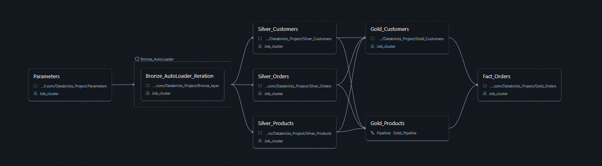
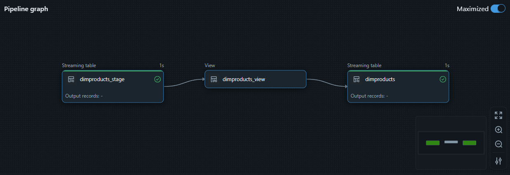

# Azure Databricks End-to-End Data Engineering Project  
Sales Analytics Pipeline using Delta Lake, DLT, and Power BI

## Overview
This project demonstrates a complete end-to-end data engineering and analytics solution implemented using Azure Databricks, ADLS Gen2, Delta Lake, Delta Live Tables (DLT), and Power BI. The goal of the project is to ingest, transform, and analyze sales datasets including Customers, Orders, and Products, and generate business insights such as sales performance and customer behavior.

The solution leverages the Medallion Architecture (Bronze, Silver, Gold) and Unity Catalog for centralized governance, access control, and data lineage tracking.

---

## High-Level Architecture
The following diagram represents the overall architecture for the solution pipeline.

---

## Project Workflow Summary
1. Provisioned Azure resource group and created an ADLS Gen2 storage account, Access Connector for Azure Databricks, and Azure Databricks workspace.
2. Enabled hierarchical namespace in ADLS and created a storage container with four logical zones:
   - source
   - bronze
   - silver
   - gold
3. Uploaded raw datasets to the source folder and configured a dynamic ingestion pipeline for external data pulls.
4. Created a Unity Metastore and enabled Unity Catalog using the ADLS Gen2 path.
5. Configured external locations for Bronze, Silver, and Gold layers using Access Connector credentials.
6. Developed data processing notebooks to implement incremental ingestion using Auto Loader, transformations in Silver layer, and dimensional modeling in Gold layer.
7. Built a Delta Live Tables (DLT) pipeline for automated streaming transformations with lineage tracking.
8. Created a Databricks Job pipeline to orchestrate notebook and DLT execution.
9. Connected Power BI directly to Gold Delta tables for visualization and reporting.

---

## Databricks Job Workflow Diagram
This represents the full end-to-end execution pipeline inside Databricks.

---

## Delta Live Tables Gold Pipeline
The DLT pipeline performs streaming ingestion, transformation, and creation of business-ready tables.

---

## Medallion Architecture Implementation

### Bronze Layer
- Raw incremental ingestion from ADLS source zone using Databricks Auto Loader
- Stored in Delta format with minimal transformation

### Silver Layer
- Cleansing, standardization, and joining of Customers, Orders, and Products datasets
- Handling of type conversions and missing field values

### Gold Layer
- Creation of Fact and Dimension tables for analytical consumption
- Optimized for dashboarding and reporting through Power BI

---

## Dataset Description
The Sales Analytics dataset used for this project contains:
- Customer information
- Product catalog
- Order transaction history

The dataset enables KPIs such as revenue trends, product contribution analysis, and customer purchase patterns.

---

## Technologies Used
- Azure Databricks
- Delta Lake
- Delta Live Tables (DLT)
- Unity Catalog
- ADLS Gen2
- Power BI
- Python / PySpark / SQL

---

## Future Enhancements
- Automating deployment using Azure DevOps CI/CD pipelines
- Adding slowly changing dimensions (SCD Type 2) support
- Introducing streaming-based ingestion for real-time updates
- Expanding lineages visualization and governance details using Unity Catalog features

---

## Conclusion
This project demonstrates a scalable and production-ready data engineering pipeline using Azure cloud components and Databricks. With automated ingestion, secure governed storage, transformation orchestration, and analytical dashboards, the solution addresses modern data analytics requirements and provides a solid foundation for enterprise-grade data platforms.

